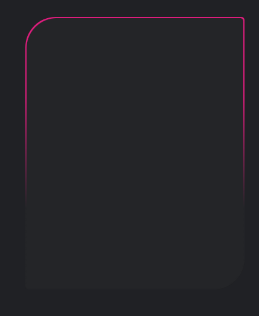

youtube: https://www.youtube.com/watch?v=8OgMWKo0T0c&t=312s

实现的效果：

基本实现原理：使用渐变的背景图来模拟动效的 border，简单来说就是将一个使用 liner-gradient 生成的背景图铺在内容的底层，然后使用 inset 露出部分区域达到 border 的效果，静态的实现如下图所示


将背景图作为渐变色之一组合极客

使用到的核心 css 属性：

```css
overflow: hidden;
background: linear-gradient(
  60deg,
  transparent,
  var(--main-color),
  var(--main-color)
);
/* 元素变换的基点（transform origin）为元素的右下角。当应用变换（如旋转、缩放等）时，元素会围绕这个基点进行变换。 请详见下方animate中的transform设置的属性值，会根据这个基点进行变换*/
transform-origin: bottom right;
animation: animate 6s linear infinite;
animation-delay: -3s;
@keyframes animate {
  0% {
    transform: rotate(0deg);
  }
  100% {
    transform: rotate(360deg);
  }
}
```

## 备注：mac 下生成 gif 的方式

使用 QT Player 录制，然后使用 ffmpeg 压缩
`ffmpeg -i file.mov -r 15 file.gif`
